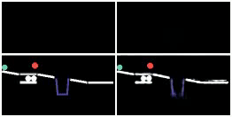
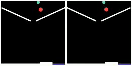

# SlotFormer

[**SlotFormer: Unsupervised Visual Dynamics Simulation with Object-Centric Models**](https://slotformer.github.io/)<br/>
[Ziyi Wu](https://wuziyi616.github.io/),
[Nikita Dvornik](https://scholar.google.com/citations?user=UOLJQTIAAAAJ&hl=en),
[Klaus Greff](https://qwlouse.github.io/),
[Thomas Kipf](https://tkipf.github.io/),
[Animesh Garg](https://animesh.garg.tech/)<br/>
_[ICLR'23](https://openreview.net/forum?id=TFbwV6I0VLg) |
[GitHub](https://github.com/pairlab/SlotFormer) |
[arXiv](https://arxiv.org/abs/2210.05861) |
[Project page](https://slotformer.github.io/)_

Ground-Truth &nbsp;&nbsp;&nbsp;&nbsp;&nbsp;&nbsp; Our Prediction | Ground-Truth &nbsp;&nbsp;&nbsp;&nbsp;&nbsp;&nbsp; Our Prediction
:--------------------------------------------------:|:--------------------------------------------------: 
  |  

## Introduction

This is the official PyTorch implementation for paper: [SlotFormer: Unsupervised Visual Dynamics Simulation with Object-Centric Models](https://arxiv.org/abs/2210.05861), which is accepted by ICLR 2023.
The code contains:

-   Training base object-centric slot models
-   Video prediction task on OBJ3D and CLEVRER
-   VQA task on CLEVRER
-   VQA task on Physion
-   Planning task on PHYRE

## Update

-   2023.1.20: The paper is accepted by ICLR 2023!
-   2022.10.26: Support Physion VQA task and PHYRE planning task
-   2022.10.16: Initial code release!
    -   Support base object-centric model training
    -   Support SlotFormer training
    -   Support evaluation on the video prediction task
    -   Support evaluation on the CLEVRER VQA task

## Installation

Please refer to [install.md](docs/install.md) for step-by-step guidance on how to install the packages.

## Experiments

**This codebase is tailored to [Slurm](https://slurm.schedmd.com/documentation.html) GPU clusters with preemption mechanism.**
For the configs, we mainly use RTX6000 with 24GB memory (though many experiments don't require so much memory).
Please modify the code accordingly if you are using other hardware settings:

-   Please go through `scripts/train.py` and change the fields marked by `TODO:`
-   Please read the config file for the model you want to train.
    We use DDP with multiple GPUs to accelerate training.
    You can use less GPUs to achieve a better memory-speed trade-off

### Dataset Preparation

Please refer to [data.md](docs/data.md) for steps to download and pre-process each dataset.

### Reproduce Results

Please see [benchmark.md](docs/benchmark.md) for detailed instructions on how to reproduce our results in the paper.

## Citation

Please cite our paper if you find it useful in your research:

```
@article{wu2022slotformer,
  title={SlotFormer: Unsupervised Visual Dynamics Simulation with Object-Centric Models},
  author={Wu, Ziyi and Dvornik, Nikita and Greff, Klaus and Kipf, Thomas and Garg, Animesh},
  journal={arXiv preprint arXiv:2210.05861},
  year={2022}
}
```

## Acknowledgement

We thank the authors of [Slot-Attention](https://github.com/google-research/google-research/tree/master/slot_attention), [slot_attention.pytorch](https://github.com/untitled-ai/slot_attention), [SAVi](https://github.com/google-research/slot-attention-video/), [RPIN](https://github.com/HaozhiQi/RPIN) and [Aloe](https://github.com/deepmind/deepmind-research/tree/master/object_attention_for_reasoning) for opening source their wonderful works.

## License

SlotFormer is released under the MIT License. See the LICENSE file for more details.

## Contact

If you have any questions about the code, please contact Ziyi Wu dazitu616@gmail.com
